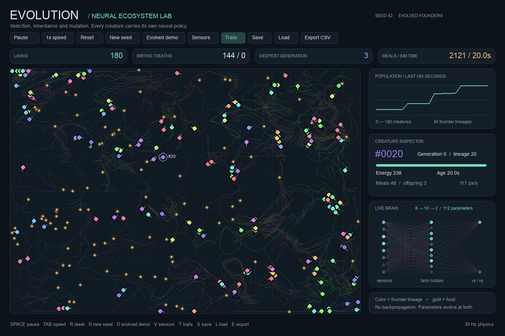
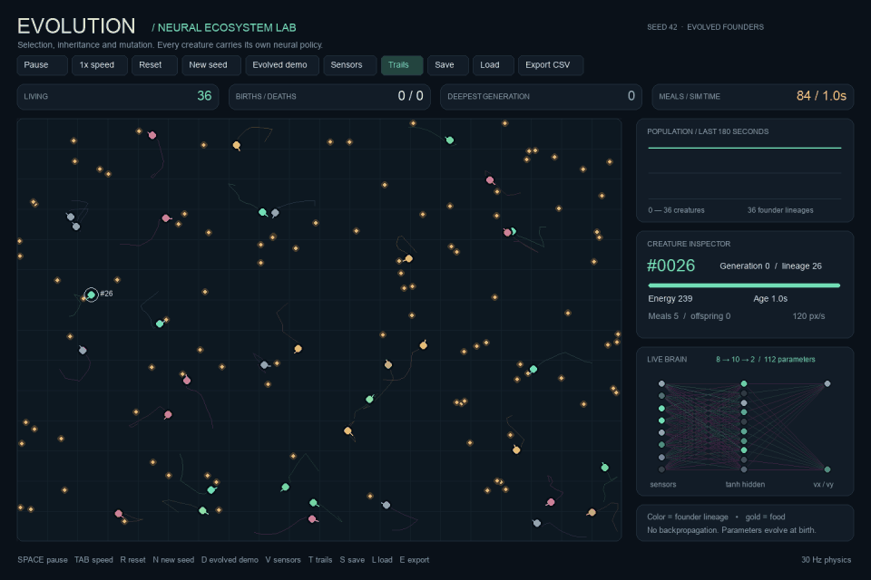
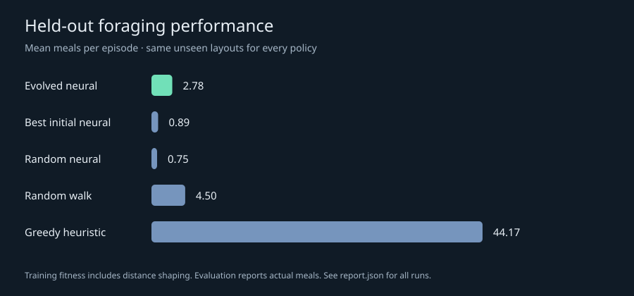

# Neuroevolution Ecosystem Simulator

**A visual laboratory for evolving neural-network-controlled creatures.**

Creatures sense nearby food, spend energy to move, compete for resources, and pass
mutated neural policies to their offspring. Inspect a live brain, follow founder
lineages, resume an exact checkpoint, or run reproducible training experiments without
opening a window.

**Python · Pygame · neural networks from scratch · evolutionary optimization**



## Run the demo

Requires Python **3.9+** and a desktop display for the interactive dashboard.

```bash
git clone https://github.com/Evanlei/evolution-simulator.git
cd evolution-simulator
python3 -m venv .venv
source .venv/bin/activate
python -m pip install -r requirements.txt
python main.py --brain results/benchmark/champion.json
```

On Windows, activate with `.venv\Scripts\activate` and use `python` in place of
`python3`. The only runtime dependency is Pygame 2.6.1. No API keys, model downloads,
GPU, or network connection are needed after installation.

The command above starts with an **evolved policy** selected using training fitness.
For an experiment starting from random networks, use `python main.py`. Random
populations can die out; the simulator displays extinction and does not silently reseed.
Press **D** or click **Evolved demo** to switch to the included learned policy.

<details>
<summary>Watch the six-second animated demo</summary>



This is an offline capture of 48 simulated seconds, played back at 8x speed. All
founders in this capture use the exported evolved policy; descendants mutate at birth.

</details>

## What is implemented

- **Neural decisions:** an 8–10–2 feed-forward tanh network, with 112 heritable
  weights/biases, implemented directly in Python.
- **An energy-based ecosystem:** local food sensing, speed-dependent costs, bounded
  motion, feeding, death, reproduction cooldowns, and energy-conserving offspring.
- **Evolution and ancestry:** independent Gaussian mutations, parent IDs, generation
  depth, founder lineages, and a population cap.
- **An interactive lab:** click-to-inspect creatures, activation diagrams with hover
  values, lineage colors, trails, sensing overlays, and a population-history chart.
- **Reproducibility:** seeded random streams, fixed physics steps, full JSON
  checkpoints including RNG state, CSV telemetry, and policy import/export.
- **Experiments:** elitist/tournament evolutionary training, disjoint training/test
  environments, random-network, random-walk and greedy baselines, raw results and charts.
- **Performance structure:** a uniform-grid food index and a headless engine separated
  from rendering.

## Controls

| Key / action | Effect |
| --- | --- |
| Click a creature | Inspect energy, meals, offspring, lineage and neural activations |
| Hover a neuron | Show its input/activation value |
| Space | Pause or resume |
| Tab | Cycle 1×, 2×, 4× and 8× playback |
| R | Reset the current seed and founder policy |
| N | New seed with random founder brains |
| D | Reset with the included evolved policy |
| V / T | Toggle sensing lines / movement trails |
| S / L | Save / load `runs/latest/world.json`; loading pauses playback |
| E | Export telemetry and the ecosystem champion to `runs/latest/` |
| Esc | Close |

Command-line `--output` changes the destination used by Save, Load and Export.
Colors identify founder lineages, not fitness or species. The live generation statistic
is ancestry depth, rather than a synchronized generation counter.

## Measured results

Three independent training runs used **28 policies**, **20 evolutionary generations**
(plus the initial population), and **six training layouts per run**. Each final policy
was evaluated on the same **20 previously unused layouts**, for **25 seconds per
episode**, with one creature, 60 respawning food sources, and reproduction disabled.
Model selection never used these test scores.

| Policy | Mean meals per held-out episode | SD of the three run means |
| --- | ---: | ---: |
| Evolved neural controller | **36.98** | 4.71 |
| Best initial neural controller, selected on training layouts | 5.25 | 3.67 |
| Randomly initialized neural controller | 1.20 | 0.84 |
| Random-walk reference | 3.65 | 0.00 |
| Hand-written greedy reference | 46.15 | 0.00 |

The evolved policies collected **7.04× as much food as the best initial policies** on
these held-out layouts, but still underperformed the greedy reference. The two reference
controllers are identical across training runs, explaining their zero across-run SD;
their episode outcomes still vary by layout. There are 20 distinct test layouts reused
across three trained policies, not 60 independent layouts. These are descriptive results
from a small experiment, not a statistical significance claim.



Training fitness rewards meals, signed progress toward sensed food, and survival. The
table reports **actual meals**, not that shaped fitness. The benchmark is a controlled
single-agent test; it does not prove indefinite improvement in a competing ecosystem.

A separate 300-second ecosystem smoke test using the training-selected policy and seed
42 finished with 180 living creatures, 180 births, 36 deaths, and generation depth 4.
It reached the explicit population cap. This verifies long-run operation for that
configuration, not general ecological stability. See [the metrics](results/ecosystem/metrics.csv).

Raw evidence: [experiment report](results/benchmark/report.json),
[all evaluation episodes](results/benchmark/episodes.csv), and the training CSVs in
[`results/benchmark/`](results/benchmark/). A weaker, earlier sensor encoding is preserved
in [`results/pilot/`](results/pilot/) with its limitations and reproduction instructions.

## Reproduce the experiments

```bash
python experiments.py --output runs/benchmark \
  --seeds 11 22 33 --population 28 --generations 20 \
  --seconds 25 --training-episodes 6 --test-episodes 20
```

The runner prints progress and writes policies, per-generation training CSVs, raw
evaluation rows, a JSON summary, and an SVG comparison chart. It uses separate random
streams for policy construction, environment layouts and random-walk behavior. Exact
reproduction was checked locally with Python 3.9.6; floating-point/library differences
can affect results on other versions. The full benchmark takes several minutes on a
laptop; a quick pipeline check is:

```bash
python experiments.py --output runs/quick --seeds 11 \
  --population 4 --generations 2 --seconds 2 --training-episodes 1 --test-episodes 2
```

## Headless runs and checkpoints

```bash
# Run 60 simulated seconds without a window; writes metrics.csv and world.json.
python main.py --headless --seed 42 --population 36 --food 100 --seconds 60

# Resume the exact saved state for another 30 simulated seconds.
python main.py --headless --load runs/latest/world.json --seconds 30

# Inspect a checkpoint visually, or start with an exported policy.
python main.py --load runs/latest/world.json
python main.py --brain runs/latest/champion.json

# Reproduce the ecosystem smoke test.
python main.py --headless --brain results/benchmark/champion.json \
  --seed 42 --seconds 300 --output runs/ecosystem
```

Checkpoints store current agents, food, ancestry, counters, history, founder policy and
all random-generator states. They are versioned JSON, not executable pickle files.
Generated runs are ignored by Git. Save and Export intentionally replace files with
the same names in the selected output folder.

## Tests

```bash
python -m unittest discover -s tests -v
```

Tests cover energy conservation, mutation independence, spatial queries against a
brute-force oracle, population limits, death ordering, sensing, deterministic episodes,
checkpoint continuation, training elitism, policy round trips, dashboard controls,
and consistency of the checked-in benchmark evidence. UI tests use SDL's offscreen
driver. The [GitHub Actions workflow](.github/workflows/tests.yml) runs tests and
command-line smoke checks on Python 3.9 and 3.12 for pushes and pull requests.

For rendering in environments without desktop access, use SDL's offscreen driver:

```bash
SDL_VIDEODRIVER=dummy SDL_AUDIODRIVER=dummy python main.py \
  --frames 3 --screenshot runs/dashboard.png
```

Use `--headless` when no rendering is needed. Native macOS windows require access to
the desktop session; launch the dashboard from a normal desktop terminal.

## Architecture

The engine, controllers, visualization and experiment runner are separate modules.
Read [the architecture guide](docs/ARCHITECTURE.md) for the network equations, update
order, energy model, checkpoint format and known limitations.

## Regenerate demo assets

To regenerate the screenshot and animation (optional Pillow dependency):

```bash
python -m pip install -r requirements-demo.txt
python tools/render_demo.py
python tools/encode_demo.py
```

## Future work

Potential extensions include limited-energy food regeneration, obstacles, distance
inputs, crossover, larger networks, and repeated ecological trials.
